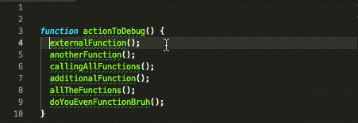
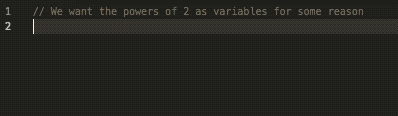

# Replace Selection Extension

This extension replaces your current selections with either the corresponding line number or the corresponding cursor number.

## Installation

In VSCode extensions search for `publisher:"nexusoft" Replace Selection` the only result should be this extension

## Use

Open your command window _(default shift + command + p on osx, ctrl + shift + p on windows)_ and use one of this extensions commands:

`Replace With Current Cursor Index`
 * Replace the current selection with the current cursor number. Meaning if you have multiple cursors the first selection will be replaced with 0, the second with 1, etc

`Replace With Line Number`
 * Replace the current selection with the current line number, 1 indexed, because line numbers follow false gods

`Replace With Evaluated Javascript Result`
 * Replace the current selection with the evaluated javascript result, eg 1 + 1 becomes 2

## Release Notes

### 0.0.1

Initial release, working line and cursor replacements

### 0.0.4

Added `Replace With Evaluated Javascript Result` as a command, simply replaces the current selection with its evaluated results
